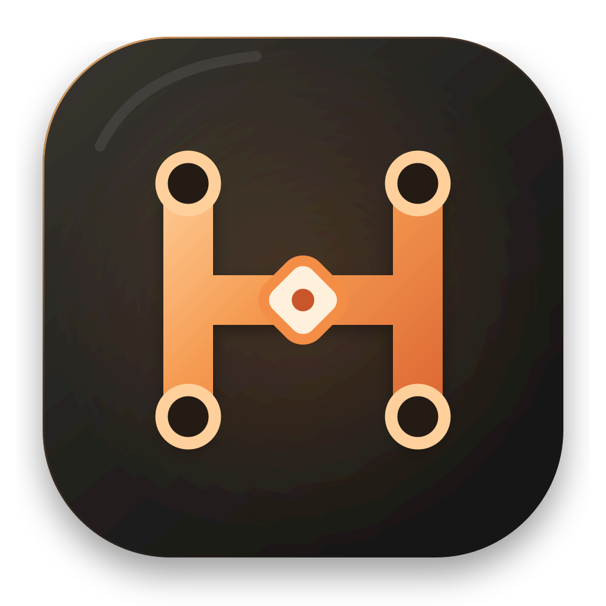

<p align="center">
  
</p>

<h1 align="center">Kuclaw</h1>

<p align="center">
  一个由 DeepSeek Harness 驱动、本地优先的桌面编程 Agent。
</p>

<p align="center">
  <a href="README.md">English</a> | <strong>中文</strong>
</p>

> [!WARNING]
> Kuclaw 目前处于开发者预览阶段。首个稳定版本发布前，接口和本地数据格式可能发生变化。

Kuclaw 是一个使用 Electron 和 React 构建的 macOS 桌面编程 Agent。它内置固定版本的 DeepSeek Harness Runtime，并通过专注的桌面界面提供生产级 Session、Agent、工具、Skill、MCP、上下文、沙箱和审批能力。

应用不会把功能受限的 `dsh-sdk-client` 作为主要接入方式。Electron 会启动真实 Desktop Host，并通过 Harness Session、Settings、Credentials、Remote Events 和 Controller API 通信。

## 核心能力

- **真实 Harness 执行**：Agent Loop、模型请求、流式输出、工具、子 Agent、取消和恢复全部运行在 DeepSeek Harness 中。
- **多模型接口**：支持 OpenAI Chat Completions、OpenAI Responses 和 Anthropic Messages 兼容接口；无需重启 Host 即可切换默认模型或当前 Session 模型。
- **持久化 Session**：日常对话和工程任务使用独立的 Harness Session 根目录，同时共享模型、凭据、Skill、MCP 和记忆配置。
- **原生工具呈现**：将 Harness 事件中的终端命令、文件读取、搜索、Web、Diff、编辑、失败和后台操作投影为紧凑的对话时间线。
- **Skill 与 MCP**：Skill 由 Harness 发现和执行；MCP 连接、重连、工具同步与实际调用由 Harness MCP Client 负责。
- **上下文与记忆**：Token 统计和压缩完全由 Harness 管理；内置 SQLite MCP 服务提供本地长期记忆，Renderer 不直接访问数据库。
- **沙箱与审批**：支持 Harness `read-only`、`workspace-write` 和 `danger-full-access`，审批与用户提问在没有 UI answerer 时保持 fail-closed。
- **定时 Agent**：按 Cron 和时区运行任务；每次执行都创建新的独立 Session 和 Agent，并支持暂停、恢复、立即运行、取消和历史记录。
- **桌面网络兼容**：继承显式或系统代理策略，并通过独立公网 DNS 校验安全兼容 TUN/Fake-IP。
- **自包含发行包**：生产包内置固定 Node.js、DeepSeek Harness、Desktop Host Profile 和 SQLite 记忆 MCP 服务。

## DeepSeek Harness 接入与扩展

Kuclaw 将 DeepSeek Harness 上游提交 [`c291e7961a515f6d7af9304e7fd1d257929aef26`](https://github.com/deepseek-ai/deepseek-harness/commit/c291e7961a515f6d7af9304e7fd1d257929aef26) 作为 vendored source，并在其上增加桌面产品需要的接入层和服务能力。

| 能力 | DeepSeek Harness 实现 | Kuclaw 接入方式 |
|---|---|---|
| Agent Loop 与流式输出 | [`agent-loop`](vendor/deepseek-harness/packages/core/agent-loop/src/index.ts) | [`harness-runtime.ts`](src/main/runtime/harness-runtime.ts) 将实时事件和持久化事件投影为可序列化 UI 记录。 |
| 兼容模型接口 | [`llm-pi-ai`](vendor/deepseek-harness/packages/llm/llm-pi-ai/src/index.ts) | 模型设置写入 Harness Provider Profile、Credentials 和 `agent-default-model`；通过 `session/selectModel` 切换单个 Session。 |
| Session 与恢复 | [`session-controller`](vendor/deepseek-harness/packages/api/session-controller/src/index.ts) | [`studio-runtime.ts`](src/main/runtime/studio-runtime.ts) 分别管理日常和工程 Runtime，同时以 Harness 为唯一事实来源。 |
| 文件、Shell、Web 与子 Agent | Harness [`packages`](vendor/deepseek-harness/packages) 下的工具包 | Renderer 只展示 `tool/call`、`tool/result` 和 presentation metadata，不直接执行命令或修改工作区。 |
| Skill | [`skill`](vendor/deepseek-harness/packages/skill/skill/src/index.ts) | App 负责导入和启用用户 Skill 文件，Harness 负责发现、加载和执行。 |
| MCP | [`mcp-client`](vendor/deepseek-harness/packages/mcp/mcp-client/src/index.ts) | [`mcp-manager.ts`](src/main/runtime/mcp-manager.ts) 管理产品配置和受控 Host 重启，连接和调用仍由 Harness 执行。 |
| 上下文与压缩 | [`compaction`](vendor/deepseek-harness/packages/compaction/compaction/src/index.ts) | 上下文状态和手动压缩只是 Harness 状态的轻量投影。 |
| 沙箱与审批 | [`sandbox-policy`](vendor/deepseek-harness/packages/sandbox/sandbox-policy/src/index.ts) 和 [`user-approval`](vendor/deepseek-harness/packages/interaction/user-approval/src/index.ts) | Electron 通过 Remote Events 提供 UI answerer，没有 answerer 时保持 fail-closed。 |
| Web 安全与 Fake-IP | [`web-fetch-http`](vendor/deepseek-harness/packages/web/web-fetch-http/src/index.ts) | Kuclaw 增加公共 DNS 复核，支持任意 IPv4/IPv6 Fake-IP 地址段，同时继续阻止真实私网目标。 |
| 定时 Agent | [`scheduled-tasks`](vendor/deepseek-harness/packages/schedule/scheduled-tasks/src/index.ts) 和 [`scheduled-task-controller`](vendor/deepseek-harness/packages/api/scheduled-task-controller/src/index.ts) | Host 级 SQLite 调度器为每次执行创建新的 Session 和 Agent，并向 Electron 暴露任务与运行记录 Controller。 |

### 运行边界

```text
React Renderer
  -> 可序列化 Preload API
  -> Electron 主进程
  -> 受监督的 Desktop Host 进程
  -> DeepSeek Harness Session / Settings / Credentials / Remote API
  -> Agent Loop、工具、Skill、MCP、压缩、沙箱与持久化
```

Renderer 启用 `nodeIntegration: false`、`contextIsolation: true` 和 Chromium sandbox。文件访问、Git 检查、进程创建、凭据和 Host 生命周期都保留在主进程或 Harness 中。

## 环境要求

- macOS 13 或更高版本
- 当前打包目标需要 Apple Silicon
- Node.js 24
- pnpm 11

## 开发

克隆仓库并安装 App 依赖：

```sh
git clone git@github.com:chaofan604/kuclaw.git
cd kuclaw
corepack enable
pnpm install
```

首次安装并构建 vendored Harness 工作区：

```sh
pnpm setup:harness
```

使用真实 Desktop Host 启动 Kuclaw：

```sh
pnpm dev:harness
```

如需只开发 UI，可显式启动确定性的模拟 Runtime：

```sh
pnpm dev
```

## 验证

```sh
pnpm upstream:verify
pnpm typecheck
pnpm test
pnpm build
```

生成未签名的 macOS Apple Silicon 目录包：

```sh
CSC_IDENTITY_AUTO_DISCOVERY=false pnpm package:dir
```

正式 App 默认启动真实 Harness Runtime。模拟模式只能通过显式开发命令启用；配置错误不会静默回退到模拟模式。

## 项目结构

```text
src/main/                         Electron 主进程与 IPC
src/main/runtime/                 Desktop Host、Session、MCP、记忆与策略适配
src/renderer/                     React 桌面界面
src/shared/                       Renderer/Main 可序列化契约
vendor/deepseek-harness/          固定上游源码与 Kuclaw Harness 扩展
scripts/                          开发、打包和验证工具
tests/                            App 集成测试与 Renderer 测试
docs/architecture.md              详细架构说明
upstream-lock.json                Harness、协议和内置 Node 版本锁
```

## 当前范围

- 首版原生协议限定为 OpenAI-compatible 和 Anthropic-compatible API。
- 当前发行目标是未签名的 macOS arm64。
- 模型、Session、工具、Skill、MCP、上下文、权限和定时执行均以 Harness 为执行事实来源。
- Renderer API 只返回可序列化数据，不返回 API Key 原值、文件系统句柄或进程对象。

## 上游与许可证

DeepSeek Harness 由 [DeepSeek AI](https://github.com/deepseek-ai/deepseek-harness) 开发，vendored source 保留其 [MIT License](vendor/deepseek-harness/LICENSE)。准确的上游基线以及兼容的 Node/Desktop Host 协议版本记录在 [`upstream-lock.json`](upstream-lock.json) 中。

更多实现细节见 [`docs/architecture.md`](docs/architecture.md)。
